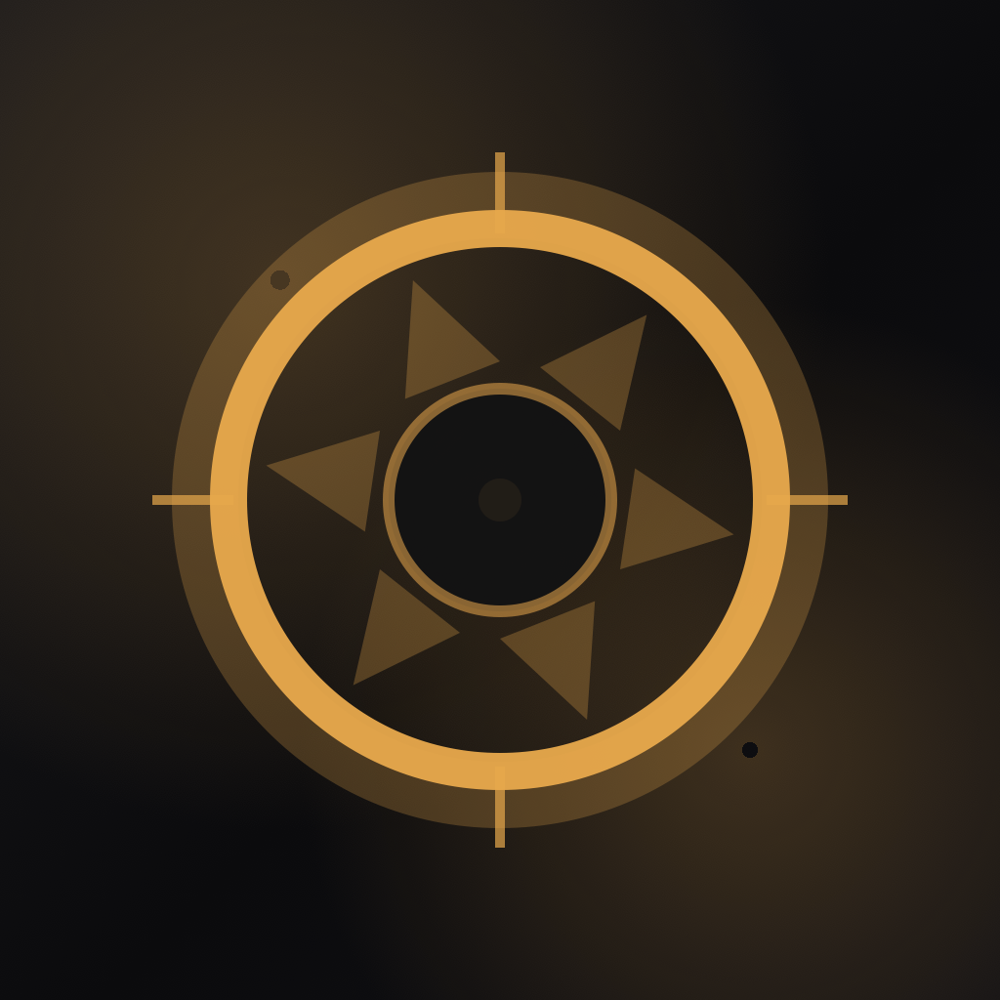

<p align="center">
  
</p>

<h1 align="center">Lumina</h1>

<p align="center">
  A precision light meter for film photographers
  <br><br>
  <a href="#">
    
  </a>
</p>

<p align="center">
  
  
  
</p>

---

## Features

- **5 Metering Modes** — Spot, center-weighted, matrix (Nikon-style 3D), highlight priority, shadow priority
- **Zone System** — Real-time Ansel Adams zone mapping (Zone 0–X) with color-coded visualization
- **Film Stock Profiles** — Portra, Tri-X, Velvia, Ektar, HP5+, and more with latitude-aware metering
- **Metal GPU Rendering** — Real-time camera processing at 12.5 Hz
- **Zebra & False Color Overlays** — Highlight and shadow visualization directly in the viewfinder
- **Exposure Calculator** — Aperture priority, shutter priority, and full manual with ±3 EV compensation

## Architecture

```
AVFoundation → CameraManager → MeteringEngine (CPU) + MetalRenderer (GPU)
                                      ↓
                               LuminaViewModel
                                      ↓
                                 SwiftUI Views
```

- **MVVM** architecture with SwiftUI
- Camera frames processed on dedicated dispatch queues
- Metering engine downsamples to 160×120 for efficient CPU analysis
- Metal shaders handle real-time viewfinder rendering

## Requirements

- iOS 18.1+
- iPhone with camera

## Building

```bash
xcodebuild -scheme "Lumina Meter" \
  -sdk iphonesimulator \
  -destination 'platform=iOS Simulator,name=iPhone 16' \
  build
```

## Privacy

Lumina processes all camera data on-device. No data is collected, stored, or transmitted. See our [Privacy Policy](https://kevinlin29.github.io/Lumina-Meter/privacy.html).

## License

All rights reserved. &copy; 2025 Kevin Lin
